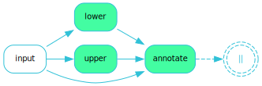
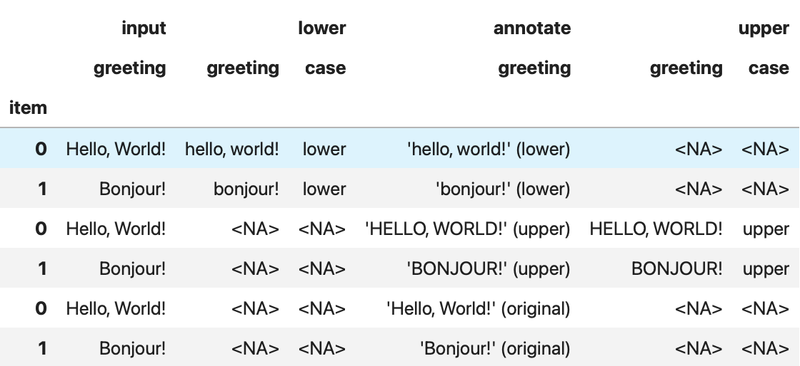

Introduction to *fluxus*
========================

*fluxus* is a Python framework designed by `BCG X <https://www.bcg.com/x>`_ to
streamline the development of complex data processing pipelines (called *flows*),
enabling users to quickly and efficiently build, test, and deploy data workflows,
making complex operations more manageable.

**FLUXUS** is inspired by the data stream paradigm and is designed to be simple,
expressive, and composable.

Introducing Flows
-----------------

A flow in *fluxus* represents a Directed Acyclic Graph (DAG) where each node performs
a specific operation on the data. These nodes, called *conduits*, are the building
blocks of a flow, and the data elements that move through the flow are referred to as
*products*. The conduits are connected to ensure that *products* are processed and
transferred correctly from one stage to another.

Within a *fluxus* flow, there are three main types of conduits:

- **Producers**: These conduits generate or gather raw data from various sources such as
  databases, APIs, or sensors. They are the entry points of the flow, feeding initial
  *products* into the system.
- **Transformers**: These conduits take the *products* from producers and transform
  them. This can involve filtering, aggregating, enriching, or changing the data to fit
  the required output or format.
- **Consumers**: Consumers represent the endpoints of the flow. Each flow has exactly
  one consumer, which handles the final processed *products*. The consumer may store the
  data, display it in a user interface, or send it to another system.

A Simple Example
----------------

Consider a simple flow that takes a greeting message, converts it to different cases
(uppercase, lowercase), and then annotates each message with the case change that
has been applied. The flow looks like this:

With *fluxus*, we can define this flow as follows:

.. code-block:: python

    from fluxus.functional import step, passthrough, run

    input_data = [
        dict(greeting="Hello, World!"),
        dict(greeting="Bonjour!"),
    ]

    def lower(greeting: str):
        # Convert the greeting to lowercase and keep track of the case change
        yield dict(
            greeting=greeting.lower(),
            case="lower",
        )

    def upper(greeting: str):
        # Convert the greeting to uppercase and keep track of the case change
        yield dict(
            greeting=greeting.upper(),
            case="upper",
        )

    def annotate(greeting: str, case: str = "original"):
        # Annotate the greeting with the case change; default to "original"
        yield dict(greeting=f"{greeting!r} ({case})")

    flow = (
        step("input", input_data)  # initial producer step
        >> ( # 3 parallel steps: upper, lower, and passthrough
            step("lower", lower)
            & step("upper", upper)
            & passthrough()  # passthrough the original input data
        )
        >> step("annotate", annotate) # annotate all outputs
    )

    # Draw the flow diagram
    flow.draw()

Note the ``passthrough()`` step in the flow. This step is a special type of conduit that
simply passes the input data along without modification. This is useful when you want to
run multiple transformations in parallel but still want to preserve the original data
for further processing.

You may have noted that the above code does not define a final consumer step. This is
because the ``run`` function automatically adds a consumer step to the end of the flow
to collect the final output. Custom consumers come into play when you start building
more customised flows using the object-oriented API instead of the simpler functional
API we are using here.

We run the flow with

.. code-block:: python

    result = run(flow)

This gives us the following output in :code:`result`:

.. code-block:: python

    RunResult(
        [
            {
                'input': {'greeting': 'Hello, World!'},
                'lower': {'greeting': 'hello, world!', 'case': 'lower'},
                'annotate': {'greeting': "'hello, world!' (lower)"}
            },
            {
                'input': {'greeting': 'Bonjour!'},
                'lower': {'greeting': 'bonjour!', 'case': 'lower'},
                'annotate': {'greeting': "'bonjour!' (lower)"}
            }
        ],
        [
            {
                'input': {'greeting': 'Hello, World!'},
                'upper': {'greeting': 'HELLO, WORLD!', 'case': 'upper'},
                'annotate': {'greeting': "'HELLO, WORLD!' (original)"}
            },
            {
                'input': {'greeting': 'Bonjour!'},
                'upper': {'greeting': 'BONJOUR!', 'case': 'upper'},
                'annotate': {'greeting': "'BONJOUR!' (original)"}
            }
        ],
        [
            {
                'input': {'greeting': 'Hello, World!'},
                'annotate': {'greeting': "'Hello, World!' (original)"}
            },
            {
                'input': {'greeting': 'Bonjour!'},
                'annotate': {'greeting': "'Bonjour!' (original)"}
            }
        ]
    )

Or, as a *pandas* data frame by calling :code:`result.to_frame()`:

Here's what happened: The flow starts with a single input data item, which is then
passed along three parallel paths. Each path applies different transformations to the
data. The flow then combines the results of these transformations into a single output,
the :code:`RunResult`.

Note that the result contains six outputs—one for each of the two input data items along
each of the three paths through the flow. Also note that the results are grouped as
separate lists for each path.

The run result not only gives us the final product of the ``annotate`` step but also the
inputs and intermediate products of the ``lower`` and ``upper`` steps. We refer to this
extended view of the flow results as the *lineage* of the flow.

For a more thorough introduction to FLUXUS, please visit our
`User Guide <https://bcg-x-official.github.io/fluxus/user_guide/index.html>`_.

Why *fluxus*?
-------------

The complexity of data processing tasks demands tools that streamline operations and
ensure efficiency. *fluxus* addresses these needs by offering a structured approach to
creating flows that handle various data sources and processing requirements. Key
motivations for using *fluxus* include:

- **Organisation and Structure**: *fluxus* offers a clear, structured approach to data
  processing, breaking down complex operations into manageable steps.
- **Maintainability**: Its modular design allows individual components to be developed,
  tested, and debugged independently, simplifying maintenance and updates.
- **Reusability**: Components in *fluxus* can be reused across different projects,
  reducing development time and effort.
- **Efficiency**: By supporting concurrent processing, *fluxus* ensures optimal use of
  system resources, speeding up data processing tasks.
- **Ease of Use**: *fluxus* provides a functional API that abstracts away the
  complexities of data processing, making it accessible to developers of all levels.
  More experienced users can also leverage the advanced features of its underlying
  object-oriented implementation for additional customisation and versatility (see
  `User Guide <https://bcg-x-official.github.io/fluxus/user_guide/index.html>`_ for more
  details).

Concurrent Processing in *fluxus*
---------------------------------

A standout feature of *fluxus* is its support for concurrent processing, allowing
multiple operations to run simultaneously. This is essential for:

- **Performance**: Significantly reducing data processing time by executing multiple
  data streams or tasks in parallel.
- **Resource Utilisation**: Maximising the use of system resources by distributing the
  processing load across multiple processes or threads.

*fluxus* leverages Python techniques such as threading and asynchronous programming to
achieve concurrent processing.

By harnessing the capabilities of *fluxus*, developers can build efficient, scalable,
and maintainable data processing systems that meet the demands of contemporary
applications.

Getting started
===============

- See the `FLUXUS Documentation <https://bcg-x-official.github.io/fluxus/home.html>`_
  for a comprehensive User Guide, API reference, and more.
- See `Contributing <CONTRIBUTING.md>`_ or visit our detailed
  `Contributor Guide <https://bcg-x-official.github.io/fluxus/contributor_guide/index.html>`_
  for information on contributing.
- We have an `FAQ <https://bcg-x-official.github.io/fluxus/faq.html>`_ for common
  questions. For anything else, please reach out to
  `artkit@bcg.com <mailto:artkit@bcg.com>`_.

User Installation
-----------------

Install using ``pip``:

.. code-block:: bash

    pip install fluxus

or ``conda``:

.. code-block:: bash

    conda install -c bcgx fluxus

Optional dependencies
^^^^^^^^^^^^^^^^^^^^^

To enable visualizations of flow diagrams, install `GraphViz <https://graphviz.org/>`_
and ensure it is in your system's PATH variable:

- For MacOS and Linux users, instructions provided on `GraphViz Downloads <https://www.graphviz.org/download/>`_ automatically add GraphViz to your path.
- Windows users may need to manually add GraphViz to your PATH (see `Simplified Windows installation procedure <https://forum.graphviz.org/t/new-simplified-installation-procedure-on-windows/224>`_).
- Run ``dot -V`` in Terminal or Command Prompt to verify installation.

Environment Setup
-----------------

Virtual environment
^^^^^^^^^^^^^^^^^^^

We recommend working in a dedicated environment, e.g., using ``venv``:

.. code-block:: bash

    python -m venv fluxus
    source fluxus/bin/activate

or ``conda``:

.. code-block:: bash

    conda env create -f environment.yml
    conda activate fluxus

Contributing
------------

Contributions to *fluxus* are welcome and appreciated! Please see the
`Contributing <CONTRIBUTING.md>`_ section for information.

License
-------

This project is under the Apache License 2.0, allowing free use, modification, and distribution with added protections against patent litigation. 
See the `LICENSE <LICENSE>`_ file for more details or visit `Apache 2.0 <https://www.apache.org/licenses/LICENSE-2.0>`_.
